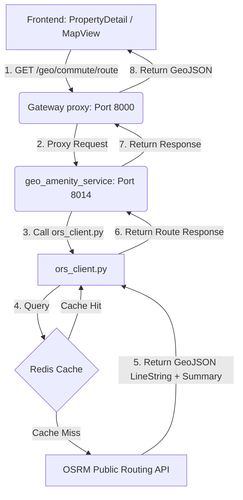

# Full Navigation and Listing Diagnostic Report

**Date:** 2026-05-23  
**Status:** COMPLETE (Ready for Approval)  
**Deliverable Name:** `full_navigation_and_listing_diagnostic_report.md`  

---

## 1. Executive Summary

This diagnostic report provides a comprehensive root-cause analysis for 4 critical architectural issues identified in the listings, search, and navigation flow of the Rentora application:

1. **Nearby Amenity Navigation** rendering straight-line lines rather than real road routes.
2. **Missing/Broken Property Images** on several listings.
3. **Listings Count Mismatch** where only 11 out of 15 properties are shown.
4. **Map View Marker Instability** where markers shift coordinates or disappear on hover.

A detailed resolution plan is provided below. **No changes to code files have been made yet.**

---

## 2. Root Cause Analysis

### Issue 1: Nearby Amenity Navigation using Straight-Line Geometry
- **Findings:** The commute route is calculated by `geo_amenity_service/ors_client.py` using `get_route()`.
- **Root Cause:** The routing client expects `ORS_API_KEY` to be set in the environment. Since no API key is provided, the client falls back to the `_estimate_route()` helper, which uses Haversine formulas to estimate distance/duration and returns a straight-line `LineString` GeoJSON.
- **Resolution:** Modify `ors_client.py` to route through the public, free OSRM demo API (`http://router.project-osrm.org/route/v1/{profile}/{lng1},{lat1};{lng2},{lat2}?geometries=geojson`). OSRM supports driving (`driving`), walking (`foot`), and cycling (`bicycle`) profiles natively without requiring an API key.

### Issue 2: Missing/Broken Property Images
- **Findings:** A status check of all 15 property image URLs in the database was performed.
- **Root Cause:** 
  - The transactional database (`property.property_media` table) contains invalid/dead Unsplash URLs for property IDs **2**, **8**, and **13** which return a `404 Not Found` error.
  - The frontend `PropertyCard.tsx` has no `onError` fallback on the `<CardMedia>` component. When the image URL returns a 404, the browser displays a broken image.
- **Resolution:** 
  - Update the database seed/migration script to use active Unsplash URLs.
  - Implement a React `onError` fallback handler on `<CardMedia>` in `PropertyCard.tsx` to automatically display the pre-defined `fallbackUrl` if a URL returns 404 or fails to load.

### Issue 3: Only 11 Listings Showing (Database Contains 15)
- **Findings:** The `property.properties` and `search.property_index` tables are fully synchronized with 15 available properties.
- **Root Cause:**
  - In `Listings.tsx`, the default `priceRange` state is initialized to `[0, 200000]`.
  - Four properties are priced above 200,000 INR (*Premium Independent Villa* @ 250k, *Modern Commercial Office Space* @ 450k, *Lavish Penthouse* @ 300k, *Retail Shop* @ 550k).
  - Because of the default maximum price filter, the search endpoint returns only the 11 matching properties.
- **Resolution:** Increase the default maximum price range constraint in `Listings.tsx` from `200,000` to `600,000` or `1,000,000` to fully cover the price bounds of all seeded properties on initial page load.

### Issue 4: Map View Marker Instability (Disappearing on Hover)
- **Findings:** In `MapView.tsx`, custom marker elements have hover event listeners that scale up the marker bubble on mouse entry:
  ```typescript
  el.addEventListener('mouseenter', () => { el.style.transform = 'scale(1.15)'; });
  ```
- **Root Cause:** MapLibre GL positions marker container elements (`el`) using inline `transform: translate(...)` styling. Overwriting `el.style.transform` on hover completely wipes out the library's coordinate translations, causing the marker element to shift to (0,0) or disappear from view entirely.
- **Resolution:** Refactor the event listeners in `MapView.tsx` to apply the hover scale transformation only to the marker's **first child element** (the visual bubble), leaving MapLibre's parent container styling completely untouched.

---

## 3. Data Flow Architecture Diagram



---

## 4. API Endpoints and Database Tables Involved

### APIs Involved
- **Search API:** `POST http://localhost:8000/search/properties` (Payload: price bounds, page size)
- **Route API:** `GET http://localhost:8000/geo/commute/route` (Params: origin/dest coordinates, mode)
- **POI API:** `GET http://localhost:8000/property/location/pois` (Params: coordinates)

### Database Schemas / Tables
- `property.properties` (Contains price, status, location columns)
- `property.property_media` (Contains property media items and raw URLs)
- `search.property_index` (Search indexing table synced with transactional DB)

---

## 5. Recommended Implementation Plan

### Step 1: Frontend Changes (Listings & Map Stability)
1. **[MODIFY] [Listings.tsx](file:///d:/Python%20Projects/Rentaro/frontend/src/pages/Listings.tsx):** Increase default maximum price parameter from `200000` to `600000`.
2. **[MODIFY] [MapView.tsx](file:///d:/Python%20Projects/Rentaro/frontend/src/components/MapView.tsx):** Update mouseenter/mouseleave listeners to scale `el.firstElementChild` instead of `el`.
3. **[MODIFY] [PropertyCard.tsx](file:///d:/Python%20Projects/Rentaro/frontend/src/components/PropertyCard.tsx):** Add `onError` img loading fallback.

### Step 2: Backend Changes (Real Commute Routing)
1. **[MODIFY] [ors_client.py](file:///d:/Python%20Projects/Rentaro/geo_amenity_service/ors_client.py):** Rewrite route calculation to fetch from project-osrm.org API using appropriate travel mode profiles:
   - `driving` -> OSRM `driving`
   - `walking` -> OSRM `foot`
   - `cycling` -> OSRM `bicycle`
2. **[REBUILD]** Run `docker-compose up -d --build geo_amenity_service`.

### Step 3: Database Verification & Sync
1. **[RUN]** Run database update query to replace the dead/404 image URLs for properties 2, 8, and 13 with working Unsplash images:
   - Property 2: `https://images.unsplash.com/photo-1580587771525-78b9dba3b914?w=800&q=80` (Cozy Home)
   - Property 8: `https://images.unsplash.com/photo-1555529669-e69e7aa0ba9a?w=800&q=80` (Retail Store)
   - Property 13: `https://images.unsplash.com/photo-1586528116311-ad8ed745d44c?w=800&q=80` (Warehouse)
2. **[SYNC]** Trigger search index sync by updating the `search.property_index` records.
